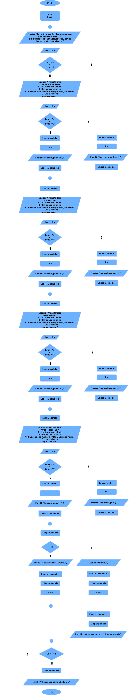

# Laboratorio de programación
## Módulo N°3 parte 2 - Estructuras de repetición.

**Funciones nuevas system("cls") y sleep()**

**Sintaxis**
```C++
    system("cls");
```
`¿Qué hace?`
Limpia la pantalla de la consola en sistemas Windows.

- `"cls"` es el comando de limpieza de pantalla del símbolo del sistema de Windows.

- `system()` ejecuta comandos del sistema operativo desde el programa.

<hr>

**Sintaxis**
```C++
    sleep(n);
```
`¿Qué hace?`

Suspende la ejecución del programa durante n segundos.

**Ejercitación**

1. Realice un programa que cuente desde 0 hasta el número ingresado por el usuario, incrementando de uno en uno. Durante el conteo, debe pausar un segundo entre cada número. Resuelva el ejercicio utilizando la estructura de repetición `for`. Además, elabore el diagrama de flujo correspondiente y la codificación en lenguaje `C++`.

**Video ilustrativo:**

<video src="Videos/video3.mp4" controls=""></video>

<hr>

2. Realice un programa que cuente desde el número ingresado por el usuario hasta 0. Durante el conteo, la pantalla debe limpiarse en cada paso. Resuelva el ejercicio utilizando la estructura de repetición `for`.
Además, elabore el diagrama de flujo correspondiente y la codificación en lenguaje C++.

**Video ilustrativo:**

<video src="Videos/video2.mp4" controls=""></video>


<hr>

### Producto factorial de un número.

3. Realice un programa que calcule el producto acumulado de los números enteros desde 1 hasta el número ingresado por el usuario, utilizando la estructura de repetición `while`. Al finalizar, debe mostrar el resultado obtenido. Realice también el diagrama de flujo y la codificación en lenguaje `C++`.

**Video ilustrativo:**

<video src="Videos/video4.mp4" controls=""></video>

<hr>

4. Realice el programa en base al siguiente diagrama de flujo, respetando la lógica y la secuencia de operaciones que en él se indican.

<br>



<hr>

**Video ilustrativo:**

<video src="Videos/video1.mp4" controls=""></video>